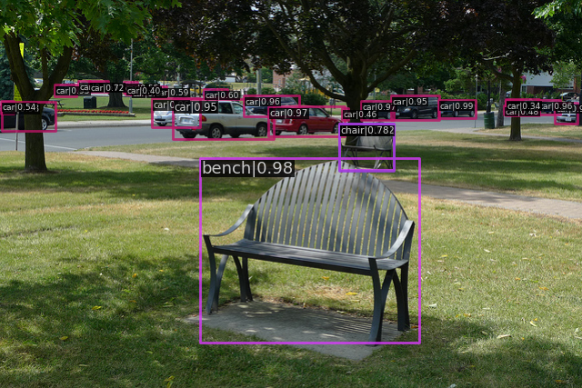

# Quick Run


MMDetection은 [Model zoo](https://mmdetection.readthedocs.io/en/latest/model_zoo.html) 에서 수많은 객체 탐지 모델을 제공하고, Pascal VOC, COCO, CityScapes, LVIS 등을 포함한 여러가지 데이터 세트를 지원한다.

---

## 목차


1. [기존 모델을 사용하여 주어진 이미지 추론](##1.기존-모델을-사용하여-주어진-이미지-추론)

2. [표준 데이터 세트에서 기존 모델을 테스트](#2-표준-데이터-세트에서-기존-모델을-테스트)

3. [표준 데이터 세트에서 사전 정의된 모델을 학습](#표준-데이터-세트에서-사전-정의된-모델-학습)

---

## 1. 기존 모델을 사용하여 주어진 이미지 추론
추론이란 훈련된 모델을 사용해 이미지에서 객체를 탐색하는 것을 의미한다.
MMDetection에서 모델은 구성 파일에 의해 정의되고 기존 모델의 매개변수는 체크포인트파일에 저장된다.

우선 이 구성파일(configure file)과 체크포인트(ckp) 파일을 사용하여 Faster RCNN을 사용 해보는 것을 권장한다.
<br>  
<br>  

**<U>추론을 위한 고급 API 사용 예시</U>**

``` python
## git mmdetection 이 설치되어있어야 한다.

from mmdet.apis import init_detector, inference_detector
import mmcv

# Specify the path to model config and checkpoint file
config_file = 'configs/faster_rcnn/faster_rcnn_r50_fpn_1x_coco.py'

## 
checkpoint_file = 'checkpoints/faster_rcnn_r50_fpn_1x_coco_20200130-047c8118.pth'

# build the model from a config file and a checkpoint file
# os.environ['CUDA_LAUNCH_BLOCKING'] = "1" 쿠다 오류가 있는 경우 해당설정을 통해 에러가 발생하지 않음.
model = init_detector(config_file, checkpoint_file, device='cuda:0')

# test a single image and show the results
img = 'demo.jpg'  # or img = mmcv.imread(img), which will only load it once
result = inference_detector(model, img)
# visualize the results in a new window
model.show_result(img, result)
# or save the visualization results to image files
model.show_result(img, result, out_file='result.jpg')

# test a video and show the results
video = mmcv.VideoReader('demo.mp4')
for frame in video:
    result = inference_detector(model, frame)
    # show option을 추가해서 프레임단위로 결과를 볼 수 있지만 프레임 수가 많으므로 주의!
    model.show_result(frame, result, wait_time=1) 
```

***입력 이미지***


***출력 이미지***



## deomos
소스코드 동작 스크립트 제공 (mmdetction/demo)

이미지 객체 검출 데모
```bash
python demo/image_demo.py \
    ${IMAGE_FILE} \
    ${CONFIG_FILE} \
    ${CHECKPOINT_FILE} \
    [--device ${GPU_ID}] \
    [--score-thr ${SCORE_THR}]
```

 실제 사용 예시
```bash
python demo/image_demo.py demo/demo.jpg configs/faster_rcnn/faster_rcnn_r50_fpn_1x_coco.py checkpoints/faster_rcnn_r50_fpn_1x_coco_20200130-047c8118.pth --device cuda --score-thr 0.3 --out-file 'image_deomo_output.png'
```
---
비디오 데모
```bash
python demo/video_demo.py \
    ${VIDEO_FILE} \
    ${CONFIG_FILE} \
    ${CHECKPOINT_FILE} \
    [--device ${GPU_ID}] \
    [--score-thr ${SCORE_THR}] \
    [--out ${OUT_FILE}] \
    [--show] \
    [--wait-time ${WAIT_TIME}]
```

실제 사용 예시
```bash
python demo/video_demo.py demo/demo.mp4 \
    configs/faster_rcnn/faster_rcnn_r50_fpn_1x_coco.py \
    checkpoints/faster_rcnn_r50_fpn_1x_coco_20200130-047c8118.pth \
    --out result.mp4
```

GPU 사용 비디오 데모
```bash
python demo/video_gpuaccel_demo.py \
    ${VIDEO_FILE} \
    ${CONFIG_FILE} \
    ${CHECKPOINT_FILE} \
    [--device ${GPU_ID}] \
    [--score-thr ${SCORE_THR}] \
    [--nvdecode] \
    [--out ${OUT_FILE}] \
    [--show] \
    [--wait-time ${WAIT_TIME}]
```

실제 사용 예시
```bash
python demo/video_gpuaccel_demo.py demo/demo.mp4 \
    configs/faster_rcnn/faster_rcnn_r50_fpn_1x_coco.py \
    checkpoints/faster_rcnn_r50_fpn_1x_coco_20200130-047c8118.pth \
    --nvdecode --out result.mp4
```
---

## 2. 표준 데이터 세트에서 기존 모델을 테스트
일부 표준 데이터 세트를 사용하여 모델의 정확도를 평가합니다. MMdetection은 CoCo, Pascal VOC, CityScapes 등을 포함한 표준 데이터 세트를 지원한다.

## 데이터 세트 준비
[Pascal VOC](http://host.robots.ox.ac.uk/pascal/VOC/index.html) , [CoCo](#https://cocodataset.org/#download) 와 같은 공개 데이터 세트는 공식 웹 사이트 또는 링크를 참조 할 수 있다.<br>
(참고: 객체 탐지 작업에서 Pascal VOC 2012는 Pascal VOC 2007의 중복 없는 확장이며 일반적으로 함께 사용한다. ) <br>
$MMdetection/data 프로젝트 디렉토리 외부 어딘가에 데이터셋을 다운로드하여 추출하고 아래와 같이 데이터셋 루트를 심볼릭 링크하는 것이 좋다. 폴더 구조가 다른 경우 구성 파일에 해당 경로를 변경해야 할 수 있다.

COCO와 같은 데이터 세트를 다운로드하기 위한 스크립트를 제공합니다. 실행 하여 COCO 데이터 세트를 다운로드할 수 있다.
```bash
python tools/misc/download_dataset.py --dataset-name coco2017
```

자세한 사용법은 [dataset-download](https://github.com/open-mmlab/mmdetection/blob/master/docs/en/useful_tools.md#dataset-download) 를 참조하십시오.

```bash
mmdetection
├── mmdet
├── tools
├── configs
├── data
│   ├── coco
│   │   ├── annotations
│   │   ├── train2017
│   │   ├── val2017
│   │   ├── test2017
│   ├── cityscapes
│   │   ├── annotations
│   │   ├── leftImg8bit
│   │   │   ├── train
│   │   │   ├── val
│   │   ├── gtFine
│   │   │   ├── train
│   │   │   ├── val
│   ├── VOCdevkit
│   │   ├── VOC2007
│   │   ├── VOC2012
```
일부 모델에는 HTC, DetectoRS 및 SCNet과 같은 추가 COCO 데이터 세트가 필요하다. 다운로드 및 압축을 푼 다음 coco 폴더로 이동할 수 있습니다. 디렉토리는 다음과 같아야 한다.

```bash
mmdetection
├── data
│   ├── coco
│   │   ├── annotations
│   │   ├── train2017
│   │   ├── val2017
│   │   ├── test2017
│   │   ├── stuffthingmaps
```

PanopticFPN과 같은 Panoptic 분할 모델에는 추가 [COCO Panoptic](http://images.cocodataset.org/annotations/panoptic_annotations_trainval2017.zip) 데이터 세트가 필요하다. 다운로드하고 압축을 푼 다음 coco Panoptic  폴더로 이동할 수 있다. 디렉토리는 다음과 같아야 한다.
```bash
mmdetection
├── data
│   ├── coco
│   │   ├── annotations
│   │   │   ├── panoptic_train2017.json
│   │   │   ├── panoptic_train2017
│   │   │   ├── panoptic_val2017.json
│   │   │   ├── panoptic_val2017
│   │   ├── train2017
│   │   ├── val2017
│   │   ├── test2017
```

도시 경관 주석은 다음을 사용하여 coco 형식으로 변환해야 한다.
```bash
tools/dataset_converters/cityscapes.py.
```
```bash
pip install cityscapesscripts

python tools/dataset_converters/cityscapes.py \
    ./data/cityscapes \
    --nproc 8 \
    --out-dir ./data/cityscapes/annotations
```

---
## 기존 모델 테스트
COCO, PASCAL VOC, Cityscapes 등 데이터 세트에서 기존 모델을 평가히기 위한 트스트 스크립트를 제공한다.

- 단일 GPU
- CPU
- 단일 노드 다중 GPU
- 여러 노드

테스트 환경에 따라 수행할 적절한 스크립트를 선택하여 실행한다.
```bash
# single-gpu testing
python tools/test.py \
    ${CONFIG_FILE} \
    ${CHECKPOINT_FILE} \
    [--out ${RESULT_FILE}] \
    [--eval ${EVAL_METRICS}] \
    [--show]

# CPU: disable GPUs and run single-gpu testing script
export CUDA_VISIBLE_DEVICES=-1
python tools/test.py \
    ${CONFIG_FILE} \
    ${CHECKPOINT_FILE} \
    [--out ${RESULT_FILE}] \
    [--eval ${EVAL_METRICS}] \
    [--show]

# multi-gpu testing
bash tools/dist_test.sh \
    ${CONFIG_FILE} \
    ${CHECKPOINT_FILE} \
    ${GPU_NUM} \
    [--out ${RESULT_FILE}] \
    [--eval ${EVAL_METRICS}]
```
tools/dist_test.sh 다중 노드 테스트도 지원하지만 PyTorch의 실행 유틸리티에 의존한다.

옵션 인수:
- RESULT_FILE: 피클 형식의 출력 결과 파일 이름. 지정하지 않으면 결과가 파일에 저장되지 않는다.

- EVAL_METRICS: 결과에 대해 평가할 항목. 허용 되는 값 은 데이터 세트 proposal_fast에 proposal따라 다르다 . 도시경관은 모든 COCO 메트릭으로 평가할 수 있 있다. .bboxsegmmAPrecallcityscapes

- --show: 지정하면 감지 결과가 이미지에 플롯되고 새 창에 표시된다.. 단일 GPU 테스트에만 적용 가능하며 디버깅 및 시각화에 사용된다.. 사용자 환경에서 GUI를 사용할 수 있는지 확인이 필요하다. 그렇지 않으면 와 같은 오류가 발생할 수 있다.cannot connect to X server

- --show-dir: 지정하면 감지 결과가 이미지에 그려지고 지정된 디렉토리에 저장된다. 단일 GPU 테스트에만 적용 가능하며 디버깅 및 시각화에 사용된다. 이 옵션을 사용하기 위해 사용자 환경에서 사용 가능한 GUI가 필요하지 않다.

- --show-score-thr: 지정된 경우 이 임계값 미만의 점수를 가진 탐지는 제거된다.

- --cfg-options: 지정된 경우 키-값 쌍 선택적 cfg가 구성 파일에 병합된다.

- --eval-options: 지정된 경우 키-값 쌍 선택적 eval cfg는 dataset.evaluate() 함수에 대해 kwargs가 되며 평가 전용이다.

### 사용 예시
체크포인트를 이미 다운로드 했다고 가정한다. (checkpoints/)
1. Faster R-CNN을 테스트하고 결과를 시각화합니다. 구성 및 체크 포인트 파일 -> [여기에서](https://github.com/open-mmlab/mmdetection/tree/master/configs/faster_rcnn)

```bash
python tools/test.py \
    configs/faster_rcnn/faster_rcnn_r50_fpn_1x_coco.py \
    checkpoints/faster_rcnn_r50_fpn_1x_coco_20200130-047c8118.pth \
    --show
```

2. Faster R-CNN을 테스트하고 향후 시각화를 위해 칠해진 이미지를 저장한다. 구성 및 체크포인트 파일 -> [여기에서](https://github.com/open-mmlab/mmdetection/tree/master/configs/faster_rcnn)
```bash
python tools/test.py \
    configs/faster_rcnn/faster_rcnn_r50_fpn_1x_coco.py \
    checkpoints/faster_rcnn_r50_fpn_1x_coco_20200130-047c8118.pth \
    --show-dir faster_rcnn_r50_fpn_1x_results
```

3. PASCAL VOC에서 Faster R-CNN을 테스트하고(테스트 결과를 저장하지 않고) mAP를 평가합니다. 구성 및 체크포인트 파일 -> [여기에서](https://github.com/open-mmlab/mmdetection/tree/master/configs/pascal_voc)
```bash
python tools/test.py \
    configs/pascal_voc/faster_rcnn_r50_fpn_1x_voc.py \
    checkpoints/faster_rcnn_r50_fpn_1x_voc0712_20200624-c9895d40.pth \
    --eval mAP
```

4. 8개의 GPU로 마스크 R-CNN을 테스트하고 bbox 및 마스크 AP를 평가합니다. 구성 및 체크포인트 파일은 -> [여기에서](https://github.com/open-mmlab/mmdetection/tree/master/configs/mask_rcnn)
```bash
./tools/dist_test.sh \
    configs/mask_rcnn_r50_fpn_1x_coco.py \
    checkpoints/mask_rcnn_r50_fpn_1x_coco_20200205-d4b0c5d6.pth \
    8 \
    --out results.pkl \
    --eval bbox segm
```

5. 8개의 GPU로 마스크 R-CNN을 테스트하고 클래스별 bbox 및 마스크 AP를 평가 합니다 . 구성 및 체크포인트 파일 -> [여기에서](https://github.com/open-mmlab/mmdetection/tree/master/configs/mask_rcnn)
```bash
./tools/dist_test.sh \
    configs/mask_rcnn/mask_rcnn_r50_fpn_1x_coco.py \
    checkpoints/mask_rcnn_r50_fpn_1x_coco_20200205-d4b0c5d6.pth \
    8 \
    --out results.pkl \
    --eval bbox segm \
    --options "classwise=True"
```

6. 8개의 GPU가 있는 COCO test-dev에서 R-CNN을 테스트하고 공식 평가 서버에 제출할 JSON 파일을 생성합니다. 구성 및 체크포인트 파일 -> [여기에서](https://github.com/open-mmlab/mmdetection/tree/master/configs/mask_rcnn)
```bash
./tools/dist_test.sh \
    configs/mask_rcnn/mask_rcnn_r50_fpn_1x_coco.py \
    checkpoints/mask_rcnn_r50_fpn_1x_coco_20200205-d4b0c5d6.pth \
    8 \
    --format-only \
    --options "jsonfile_prefix=./mask_rcnn_test-dev_results"
```
이 명령어를 실행 했을 때 두 개의 JSON 파일 ```mask_rcnn_test-dev_results.bbox.json```과 ```mask_rcnn_test-dev_results.segm.json.``` 이 생성된다.

7. 8개의 GPU로 Cityscapes 테스트에서 마스크 R-CNN을 테스트하고 공식 평가 서버에 제출할 txt 및 png 파일을 생성합니다. 구성 및 체크포인트 파일 -> [여기에서](https://github.com/open-mmlab/mmdetection/tree/master/configs/cityscapes)
```bash
./tools/dist_test.sh \
    configs/cityscapes/mask_rcnn_r50_fpn_1x_cityscapes.py \
    checkpoints/mask_rcnn_r50_fpn_1x_cityscapes_20200227-afe51d5a.pth \
    8 \
    --format-only \
    --options "txtfile_prefix=./mask_rcnn_cityscapes_test_results"
```
생성된 이미지 및 txt는  ./mask_rcnn_cityscapes_test_result 디렉토리 경로에 있습니다.

---

## Ground Truth 주석 없이 테스트
MMDetection은 CocoDataset. 데이터 세트 형식이 COCO 형식이 아닌 경우 COCO 형식으로 변환하십시오. 예를 들어 데이터 세트 형식이 VOC인 경우 도구의 스크립트를 통해 COCO 형식으로 직접 변환할 수 있습니다. 데이터세트 형식이 Cityscapes인 경우 도구의 스크립트를 통해 COCO 형식으로 직접 변환할 수 있습니다 . 나머지 형식은 이 스크립트 를 사용하여 변환할 수 있습니다 .
```bash
python tools/dataset_converters/images2coco.py \
    ${IMG_PATH} \
    ${CLASSES} \
    ${OUT} \
    [--exclude-extensions]
```

arguments
- IMG_PATH : 이미지 루트 경로
- CLASSES : 범주 목록이 있는 텍스트 파일
- OUT : 주석 출력을 저장할 JSON파일 이름.  IMG_PATH와 같은 디렉토리에 저장
- exclude-extensions : 'png', 'bpm'등 제외할 이미지의 접미사.

데이터 변환이 완료되면 다음 명령을 사용하여 테스트 할 수 있다.
```bash
# single-gpu testing
python tools/test.py \
    ${CONFIG_FILE} \
    ${CHECKPOINT_FILE} \
    --format-only \
    --options ${JSONFILE_PREFIX} \
    [--show]

# CPU: disable GPUs and run single-gpu testing script
export CUDA_VISIBLE_DEVICES=-1
python tools/test.py \
    ${CONFIG_FILE} \
    ${CHECKPOINT_FILE} \
    [--out ${RESULT_FILE}] \
    [--eval ${EVAL_METRICS}] \
    [--show]

# multi-gpu testing
bash tools/dist_test.sh \
    ${CONFIG_FILE} \
    ${CHECKPOINT_FILE} \
    ${GPU_NUM} \
    --format-only \
    --options ${JSONFILE_PREFIX} \
    [--show]
```
[Model zoo](https://mmdetection.readthedocs.io/en/latest/model_zoo.html)의 체크포인트 가 디렉토리에 다운로드 되었다고 가정하면 checkpoints/8개의 GPU가 있는 COCO test-dev에서 Mask R-CNN을 테스트하고 다음 명령을 사용하여 JSON 파일을 생성할 수 있습니다.
```bash
./tools/dist_test.sh \
    configs/mask_rcnn/mask_rcnn_r50_fpn_1x_coco.py \
    checkpoints/mask_rcnn_r50_fpn_1x_coco_20200205-d4b0c5d6.pth \
    8 \
    --format-only \
    --options "jsonfile_prefix=./mask_rcnn_test-dev_results"
```
이 명령어를 실행한 결과는 두개의 JSON 파일(mask_rcnn_test-dev_results.bbox.json, mask_rcnn_test-dev_results.segm.json)을 출력한다.(저장한다.)

---
## 배치 추론
MMDetection은 테스트 모드에서 단일 이미지 또는 배치 이미지 추론을 지원한다.
기본적으로 단일 이미지 추론을 사용 samples_per_gpu 하며 테스트 데이터의 구성에서 수정하여 일괄 추론을 사용 할 수 있다. 아래와 같이 구성을 수정하여 수행할 수 있다.
```bash
data = dict(train=dict(...), val=dict(...), test=dict(samples_per_gpu=2, ...))
```
--cfg-options 은 다음과 같이 설정 할 수 있다.
```bash
--cfg-options data.test.samples_per_gpu=2
```

## 지원 중단된 Image To Tensor
테스트 모드에서 ImageToTensor 파이프라인은 더이상 사용하지 않으며, DefaultFormatBundle구성 파일의 테스트 데이터 파이프라인에서 수동으로 교체하여 사용하도록 권장된다.
```python
# use ImageToTensor (deprecated)
pipelines = [
   dict(type='LoadImageFromFile'),
   dict(
       type='MultiScaleFlipAug',
       img_scale=(1333, 800),
       flip=False,
       transforms=[
           dict(type='Resize', keep_ratio=True),
           dict(type='RandomFlip'),
           dict(type='Normalize', mean=[0, 0, 0], std=[1, 1, 1]),
           dict(type='Pad', size_divisor=32),
           dict(type='ImageToTensor', keys=['img']),
           dict(type='Collect', keys=['img']),
       ])
   ]

# manually replace ImageToTensor to DefaultFormatBundle (recommended)
pipelines = [
   dict(type='LoadImageFromFile'),
   dict(
       type='MultiScaleFlipAug',
       img_scale=(1333, 800),
       flip=False,
       transforms=[
           dict(type='Resize', keep_ratio=True),
           dict(type='RandomFlip'),
           dict(type='Normalize', mean=[0, 0, 0], std=[1, 1, 1]),
           dict(type='Pad', size_divisor=32),
           dict(type='DefaultFormatBundle'),
           dict(type='Collect', keys=['img']),
       ])
   ]
```

---
## 표준 데이터 세트에서 사전 정의된 모델 학습
MMDetection은 감지 모델 학습을 위한 기본 도구를 제공한다. 이 섹션에서는 COCO와 같은 표준 데이터 세트 에서 미리 정의된 모델([configs](https://github.com/open-mmlab/mmdetection/tree/master/configs) 하위)을 교육하는 방법을 보여줍니다.

## 데이터 세트 준비
교육에는 데이터 세트 준비가 필요하다. 자세한 내용은 위의 [데이터 세트 준비](#데이터-세트-준비) 섹션을 참조. <br>
**참고** : 현재 구성 파일은 configs/cityscapesCOCO 사전 훈련된 가중치를 사용하여 초기화한다. 네트워크 연결이 불가능하거나 느린 경우 훈련 시작 시 오류가 발생할 수 있습니다. 이러한 경우 기존 모델을 미리 다운로드하여 사용 할 수 있다.

## 학습률이 자동으로 조정됨
**중요** : 구성 파일의 기본 학습률은 GPU 8개와 GPU당 샘플 2개다.(배치 크기 = 8 * 2 = 16). 그리고 그것은 `config/_base_/default_runtime.py` 의  `auto_scale_lr.base_batch_size` 로 설정 한다.  배치 크기가 16 인 경우 이 값을 기준으로 학습률이 자동으로 조정된다. 한편, mmdet을 기반으로 하는 다른 코드베이스에 영향을 주지 않기 위해 플래그 `auto_scale_lr.enable`가 기본적으로 설정되어 `False있다.

이 기능을 활성화하려면 인수를 추가해야 한다(`--auto-scale-lr`). 그리고 config 이름은 기본 배치 크기를 나타내므로 명령을 처리하기 전에 사용할 config 이름을 확인해야 한다. 다른 경우에는 어떤 배치 크기가 인지 또는 어떤 배치 크기가 인지 와 같이 구성 파일 이름이 지시 하는 것을 볼 수 있다.
```
 8 x 2 = 16 batch size  -> faster_rcnn_r50_caffe_fpn_90k_coco.pypisa_faster_rcnn_x101_32x4d_fpn_1x_coco.py 
 
 _NxM_cornernet_hourglass104_mstest_32x3_210e_coco.py 32 x 3= 96 scnet_x101_64x4d_fpn_8x1_20e_coco.py  8 x 1 = 8
 ```

사용하려는 특정 구성 파일의 맨 아래를 확인. `auto_scale_lr.base_batch_size`배치 크기가 16. 해당 값을 찾을 수 없는 경우 구성 파일을 확인 `_base_=[xxx]`하면 찾을 수 있다. LR을 자동으로 조정하려면 해당 값을 수정하지 말라.

학습률 자동 스케일 기본 사용법은 다음과 같다.
```bash
python tools/train.py \
    ${CONFIG_FILE} \
    --auto-scale-lr \
    [optional arguments]
```

학습 중에 로그 파일과 체크포인트는 구성 파일에서 또는 CLI 인수를 통해 지정된 작업 디렉토리에 저장됩니다 `--work-dir.`
기본적으로 모델은 매 에포크마다 유효성 검사 세트에서 평가되며 평가 간격은 아래와 같이 구성 파일에서 지정할 수 있습니다.
```python
# evaluate the model every 12 epoch.
evaluation = dict(interval=12)
```

인수 옵션 설정
- `--no-validate` (not suggested): 학습중 평가를 사용하지 않음
- `--work-dir ${WORK_DIR}` : 학습 저장 경로 설정
- `--resum-from ${CHECKPOINT_FILE}` : 이전에 학습한 체크포인트 파일에서 시작
- `--option 'Key=value` : 기존에 정의된 config파일에서 설정정보를 읽어 사용

노트:<br>
`resume-from` 과 `load-from` 은 다르다:<br>
`resume-from`은 모델가중치와 optimizer 상태를 불러오는 것이고, epoch 또한 지정된 checkpint에 상속된다. 이것은 보통 학습중 실수에 의해 종료되었을 때 사용된다. `load-from`은 모델의 가중치 그리고 학습 epoch 의 0인 상태 만을 불러온다. 이것은 보통 finetuning에서 사용된다.

## CPU에서 학습하기
단일 GPU에서 학습하는것과 CPU에서 학습하는것은 동일하다. GPU 사용만 비활성화 하면 된다.

```bash
export CUDA_VISIBLE_DEVICES=-1
```
이후 스크립트를 실행하면 된다.

Note:
우리는 너무 느리기 때문에 CPU에서 학습하는것을 권장하지 않는다. GPU가 없는 사용자를 위해 이 기능을 제공한다.

## 다중 GPU에서 학습하기
우리는 `tools/dist_train.sh` 에서 다중 GPU를 학습하도록 제공한다. 기본 사용방법은 아래와 같다.
```bash
bash ./tools/dist_train.sh \
    ${CONFIG_FILE} \
    ${GPU_NUM} \
    [optional arguments]
```
인수 옵션은 위에서와 동일하게 사용된다.

### 동시에 여러 작업 실행하기
만약 하나의 머신으로 동시에 여러개의 작업을 하고싶다면, 아래의 예제를 참고하라.<br>
8개의 GPU가 있을 때 2개의 작업을 4개의 GPU로 학습할 경우 포트를 다르게 지정해야 한다.
```bash
CUDA_VISIBLE_DEVICES=0,1,2,3 PORT=29500 ./tools/dist_train.sh ${CONFIG_FILE} 4
CUDA_VISIBLE_DEVICES=4,5,6,7 PORT=29501 ./tools/dist_train.sh ${CONFIG_FILE} 4
```


## 다중 머신으로 학습
간단히 이더넷으로 연결된 다중머신을 실행할 경우 아래의 명령어를 사용하면 된다.<br>
첫번째 머신 
```bash
NNODES=2 NODE_RANK=0 PORT=$MASTER_PORT MASTER_ADDR=$MASTER_ADDR sh tools/dist_train.sh $CONFIG $GPUS
```
두번째 머신:
```bash
NNODES=2 NODE_RANK=1 PORT=$MASTER_PORT MASTER_ADDR=$MASTER_ADDR sh tools/dist_train.sh $CONFIG $GPUS
```

!고속 인터넷이 없으면 속도가 느리다.!

---

## slurm 으로 작업 관리하기
slurm은 컴퓨터 클러스터를 위한 좋은 작업 관리 스케쥴링 시스템이다. 클러스터는 Slurm으로부터 관리된다.<br> `slurm_train.sh` 를 실행하여 학습작업을 실행할 수 있다. <br>
이것은 싱글 노드와 다중 노드 모두 지원한다.<br>
기본 사용 방법은 아래와 같다.
```bash
[GPUS=${GPUS}] ./tools/slurm_train.sh ${PARTITION} ${JOB_NAME} ${CONFIG_FILE} ${WORK_DIR}
```

이 예제에서는 16개의 GPU를 사용하여 dev라는 Slurm파티션에서 Mask R-CNN을 학습하도록 한다. 그리고 work-dir을 공유 파일 시스템으로 설정한다.
```bash
GPUS=16 ./tools/slurm_train.sh dev mask_r50_1x configs/mask_rcnn_r50_fpn_1x_coco.py /nfs/xxxx/mask_rcnn_r50_fpn_1x
```

[소스코드](https://github.com/open-mmlab/mmdetection/blob/master/tools/slurm_train.sh)를 확인하여 전체 인수 및 환경을 확인 할 수 있다.<br>
Slurm을 사용 할 때, 포트 옵션은 필수 사항 이므로 아래 제시한 방법중 하나를 선택해야 한다.<br>

1.`--options`를 사용해서 포트를 세팅하기. 이것은 원래 configs를 바꾸지 않기 때문에 더 권장된다.
```bash
CUDA_VISIBLE_DEVICES=0,1,2,3 GPUS=4 ./tools/slurm_train.sh ${PARTITION} ${JOB_NAME} config1.py ${WORK_DIR} --options 'dist_params.port=29500'
CUDA_VISIBLE_DEVICES=4,5,6,7 GPUS=4 ./tools/slurm_train.sh ${PARTITION} ${JOB_NAME} config2.py ${WORK_DIR} --options 'dist_params.port=29501'
```
2.config파일 을 수정하여 포트 바꾸기<br>
`config1.py`
```bash
dist_params = dict(backend='nccl', port=29500)
```
`config2.py`
```bash
dist_params = dict(backend='nccl', port=29501)
```
그 다음 아래 처럼 실행할 수 있다.
```bash
CUDA_VISIBLE_DEVICES=0,1,2,3 GPUS=4 ./tools/slurm_train.sh ${PARTITION} ${JOB_NAME} config1.py ${WORK_DIR}
CUDA_VISIBLE_DEVICES=4,5,6,7 GPUS=4 ./tools/slurm_train.sh ${PARTITION} ${JOB_NAME} config2.py ${WORK_DIR}
```
---
---
---

# 2: 맞춤형 데이터 세트로 학습하기
이 노트에서는 어떻게 맞춤형 데이터로 학습하고 추론하고 테스트 하는지에 대해 알수있다.<br>
우리는 [balloon dataset](https://github.com/matterport/Mask_RCNN/tree/master/samples/balloon)을 이용하여 전체 프로세스를 설명한다.

기본 단계는 다음과 같다:<br>
1. 맞춤형 데이터 세트 준비
2. config파일 준비
3. 맞춤형 데이터 셋으로 모델 train, test, 추론 하기.

## 맞춤형 데이터 세트 준비하기
MMDection에서 새로운 데이터셋을 준비하는 3가지 방법
1. COCO 포맷의 데이터셋으로 재 정의하기
2. 중간 포맷으로 데이터셋 재 정의하기
3. 새로운 데이터셋 구현하기

3번째 방법 보다는 더 쉬운 첫번째, 두번째 방법을 추천한다.<br>
이 노트에서는 COCO 포맷으로 변경하는 방법을 설명한다.<br>
Note: MMDetection은 현재 COCO 포맷의 데이터세트 mask AP 평가만을 지원한다. 그래서 Segmentation 문제의 사용자는 COCO포맷으로 데이터를 변환해야 한다.

## COCO annotation 포맷
COCO 포맷은 다음과 같다. 더 자세한 것을 알고싶다면 [여기](https://cocodataset.org/#format-data)를 참고하라.
```json
{
    "images": [image],
    "annotations": [annotation],
    "categories": [category]
}


image = {
    "id": int,
    "width": int,
    "height": int,
    "file_name": str,
}

annotation = {
    "id": int,
    "image_id": int,
    "category_id": int,
    "segmentation": RLE or [polygon],
    "area": float,
    "bbox": [x,y,width,height],
    "iscrowd": 0 or 1,
}

categories = [{
    "id": int,
    "name": str,
    "supercategory": str,
}]
```
풍선데이터 세트를 다운받아 사용할 때, 데이터 세트를 COCO 포맷으로 변환하는 기능을 구현해서 사용해야, 데이터 로드 및 학습 평가를 수행 할 수 있다.<br>
데이터 세트의 포맷은 아래와 같다.
```json
{'base64_img_data': '',
 'file_attributes': {},
 'filename': '34020010494_e5cb88e1c4_k.jpg',
 'fileref': '',
 'regions': {'0': {'region_attributes': {},
   'shape_attributes': {'all_points_x': [1020,
     1000,
     994,
     1003,
     1023,
     1050,
     1089,
     1134,
     1190,
     1265,
     1321,
     1361,
     1403,
     1428,
     1442,
     1445,
     1441,
     1427,
     1400,
     1361,
     1316,
     1269,
     1228,
     1198,
     1207,
     1210,
     1190,
     1177,
     1172,
     1174,
     1170,
     1153,
     1127,
     1104,
     1061,
     1032,
     1020],
    'all_points_y': [963,
     899,
     841,
     787,
     738,
     700,
     663,
     638,
     621,
     619,
     643,
     672,
     720,
     765,
     800,
     860,
     896,
     942,
     990,
     1035,
     1079,
     1112,
     1129,
     1134,
     1144,
     1153,
     1166,
     1166,
     1150,
     1136,
     1129,
     1122,
     1112,
     1084,
     1037,
     989,
     963],
    'name': 'polygon'}}},
 'size': 1115004}
 ```

이미지의 어노테이션은값은 JSON파일로 저장된다. <br>
다음은 풍선 데이터셋을 COCO 포맷으로 변환하는 코드다.
```python
import os.path as osp
import mmcv

def convert_balloon_to_coco(ann_file, out_file, image_prefix):
    data_infos = mmcv.load(ann_file)

    annotations = []
    images = []
    obj_count = 0
    for idx, v in enumerate(mmcv.track_iter_progress(data_infos.values())):
        filename = v['filename']
        img_path = osp.join(image_prefix, filename)
        height, width = mmcv.imread(img_path).shape[:2]

        images.append(dict(
            id=idx,
            file_name=filename,
            height=height,
            width=width))

        bboxes = []
        labels = []
        masks = []
        for _, obj in v['regions'].items():
            assert not obj['region_attributes']
            obj = obj['shape_attributes']
            px = obj['all_points_x']
            py = obj['all_points_y']
            poly = [(x + 0.5, y + 0.5) for x, y in zip(px, py)]
            poly = [p for x in poly for p in x]

            x_min, y_min, x_max, y_max = (
                min(px), min(py), max(px), max(py))


            data_anno = dict(
                image_id=idx,
                id=obj_count,
                category_id=0,
                bbox=[x_min, y_min, x_max - x_min, y_max - y_min],
                area=(x_max - x_min) * (y_max - y_min),
                segmentation=[poly],
                iscrowd=0)
            annotations.append(data_anno)
            obj_count += 1

    coco_format_json = dict(
        images=images,
        annotations=annotations,
        categories=[{'id':0, 'name': 'balloon'}])
    mmcv.dump(coco_format_json, out_file)
```
위 코드를 사용하여 성공적으로 어노테이션 파일을 json포맷으로 변경하면, 모델에서 CocoDataset 형태로 학습하고 평가 할 수 있다.

## Config 준비하기
다음 두번째 스텝은 config 파일을 이용해 데이터셋을 성공적으로 불러오는 것이다.
config파일을 이용해 풍선데이터셋을 학습하고 Mask R-CNN과 FPN으로 풍성을 탐지하기 원할때,  config파일은 `configs/balloon/`하위 경로에 있는 `mask_rcnn_r50_caffe_fpn_mstrain-poly_1x_balloon.py`와 같이 설정되어 있다.

```python
# The new config inherits a base config to highlight the necessary modification
_base_ = 'mask_rcnn/mask_rcnn_r50_caffe_fpn_mstrain-poly_1x_coco.py'

# We also need to change the num_classes in head to match the dataset's annotation
model = dict(
    roi_head=dict(
        bbox_head=dict(num_classes=1),
        mask_head=dict(num_classes=1)))

# Modify dataset related settings
dataset_type = 'COCODataset'
classes = ('balloon',)
data = dict(
    train=dict(
        img_prefix='balloon/train/',
        classes=classes,
        ann_file='balloon/train/annotation_coco.json'),
    val=dict(
        img_prefix='balloon/val/',
        classes=classes,
        ann_file='balloon/val/annotation_coco.json'),
    test=dict(
        img_prefix='balloon/val/',
        classes=classes,
        ann_file='balloon/val/annotation_coco.json'))

# We can use the pre-trained Mask RCNN model to obtain higher performance
load_from = 'checkpoints/mask_rcnn_r50_caffe_fpn_mstrain-poly_3x_coco_bbox_mAP-0.408__segm_mAP-0.37_20200504_163245-42aa3d00.pth'
```

checkpoint 파일은 [여기](https://download.openmmlab.com/mmdetection/v2.0/mask_rcnn/mask_rcnn_r50_caffe_fpn_mstrain-poly_3x_coco/mask_rcnn_r50_caffe_fpn_mstrain-poly_3x_coco_bbox_mAP-0.408__segm_mAP-0.37_20200504_163245-42aa3d00.pth) 에서 다운받을 수 있다.


## 새로운 모델 학습하기
새로운 config파일로 학습하기는 매우 쉽다.
```bash
python tools/train.py configs/balloon/mask_rcnn_r50_caffe_fpn_mstrain-poly_1x_balloon.py
```
더욱 자세한 사용방법은 [케이스1](https://mmdetection.readthedocs.io/en/latest/1_exist_data_model.html) 참조

## 테스트 그리고 추론
학습된 모델을 테스트하기 또한 매우 쉽다.
```bash
python tools/test.py configs/balloon/mask_rcnn_r50_caffe_fpn_mstrain-poly_1x_balloon.py work_dirs/mask_rcnn_r50_caffe_fpn_mstrain-poly_1x_balloon/latest.pth --eval bbox segm
```
더욱 자세한 사용방법은 [케이스1](https://mmdetection.readthedocs.io/en/latest/1_exist_data_model.html) 참조

---
---
---

# 3. 표준데이터셋 맞춤형 모델 학습하기
이번 노트에서는 표준데이터셋으로 맞춤형 모델을 train, test 추론 하는 것에 대해 알 수 있다.<br>
우리는 cityscapes 데이터셋을 Cascade Mask R-CNN R50모델을 사용자화 하여 학습하는 프로세스를 시연할 수 있다.`AugFPN`는 `FPN`을 neck으로 변경하고, `Rotate` or `Translate` 을 추가하여 학습시간을 자동 augm 로 사용한다.

기본 스텝은 아래와 같다.
1. 표준 데이터셋을 준비한다
2. custmoized 모델을 준비한다
3. config 파일을 준비한다.
4. 모델에서 표준데이터을  Train, test, inference 한다.

## 표준 데이터셋 준비하기
이번 노트에서는 cityscapes 표준데이터셋으로 사용한다.

폴더구조가 다르면 config파일의 path를 변경시켜야 하기 때문에 데이터셋 구조를 동일하게 구성하는 것이 좋다.
```
mmdetection
├── mmdet
├── tools
├── configs
├── data
│   ├── coco
│   │   ├── annotations
│   │   ├── train2017
│   │   ├── val2017
│   │   ├── test2017
│   ├── cityscapes
│   │   ├── annotations
│   │   ├── leftImg8bit
│   │   │   ├── train
│   │   │   ├── val
│   │   ├── gtFine
│   │   │   ├── train
│   │   │   ├── val
│   ├── VOCdevkit
│   │   ├── VOC2007
│   │   ├── VOC2012
```

또는 dataset 루트 경로를 아래와 같이 지정할 수 있다.
```bash
export MMDET_DATASETS=$data_root
```
이렇게 사용하면 데이터셋의 경로를 변경하기 때문에, config파일에 경로를 따로 변경 할 필요가 없다.

cityscapes 어노테이션은 `tools/dataset_converters/cityscapes.py`를 이용해 COCO포맷으로 변경 할 수 있다.
```bash
pip install cityscapesscripts
python tools/dataset_converters/cityscapes.py ./data/cityscapes --nproc 8 --out-dir ./data/cityscapes/annotations
```

현재의 config파일은 cityscapes에 있는 COCO 를 사전학습한 가중치를 사용해 초기화 한다. 네트워크 속도가 느린 경우 사전학습한 모델을 미리 다운로드 하여 사용 할 수 있다.

## customized 모델 준비하기
다음 두번째 스텝은 자체모듈 또는 학습을 설정하는 것이다. Cascade Mask R-CNN R50아래 FPN을 AugFPN로 대체하는 새로는 neck으로 가정한다. 다음은 MMDetection의 AugFPN이다.

1. 새로운 neck 정의하기(e.g.AugFPN)
생성할 파일 : `mmdet/models/necks/augfpn.py`
```python
from ..builder import NECKS

@NECKS.register_module()
class AugFPN(nn.Module):

    def __init__(self,
                in_channels,
                out_channels,
                num_outs,
                start_level=0,
                end_level=-1,
                add_extra_convs=False):
        pass

    def forward(self, inputs):
        # implementation is ignored
        pass
```

## 2. 모듈 Import
`mmdet/models/necks/__init__.py` 에 다음줄을 수정, 추가 할 수 있다.
```python
from .augfpn import AugFPN
```
또는 대신 아래의 코드를 추가 할 수 있다.
```python
custom_imports = dict(
    imports=['mmdet.models.necks.augfpn.py'],
    allow_failed_imports=False)
```
config 파일을 수정하고, 원본코드는 수정하지 마시오.

## 3. config 파일 수정하기
```python
neck=dict(
    type='AugFPN',
    in_channels=[256, 512, 1024, 2048],
    out_channels=256,
    num_outs=5)
```

더 자세한 사항은 [사용자모델](https://mmdetection.readthedocs.io/en/latest/tutorials/customize_models.html)과 [사용자 런타임 설정](https://mmdetection.readthedocs.io/en/latest/tutorials/customize_runtime.html)을 참고하라.

## config 준비
세번째 스텝은 config 파일의 학습을 설정하는 것이다. cityscapes 데이터셋을 학습하기 위해 Cascade Mask R-CNN R50에 데이터 증강, 회전, AugFPN등을 적용한다고 했을 때 구성 경로와 수정 파일은 다음과 같다.<br>
path : `configs/cityscapes`, <br>
file_name : `cascade_mask_rcnn_r50_augfpn_autoaug_10e_cityscapes.py`

```python
# The new config inherits the base configs to highlight the necessary modification
_base_ = [
    '../_base_/models/cascade_mask_rcnn_r50_fpn.py',
    '../_base_/datasets/cityscapes_instance.py', '../_base_/default_runtime.py'
]

model = dict(
    # set None to avoid loading ImageNet pretrained backbone,
    # instead here we set `load_from` to load from COCO pretrained detectors.
    backbone=dict(init_cfg=None),
    # replace neck from defaultly `FPN` to our new implemented module `AugFPN`
    neck=dict(
        type='AugFPN',
        in_channels=[256, 512, 1024, 2048],
        out_channels=256,
        num_outs=5),
    # We also need to change the num_classes in head from 80 to 8, to match the
    # cityscapes dataset's annotation. This modification involves `bbox_head` and `mask_head`.
    roi_head=dict(
        bbox_head=[
            dict(
                type='Shared2FCBBoxHead',
                in_channels=256,
                fc_out_channels=1024,
                roi_feat_size=7,
                # change the number of classes from defaultly COCO to cityscapes
                num_classes=8,
                bbox_coder=dict(
                    type='DeltaXYWHBBoxCoder',
                    target_means=[0., 0., 0., 0.],
                    target_stds=[0.1, 0.1, 0.2, 0.2]),
                reg_class_agnostic=True,
                loss_cls=dict(
                    type='CrossEntropyLoss',
                    use_sigmoid=False,
                    loss_weight=1.0),
                loss_bbox=dict(type='SmoothL1Loss', beta=1.0,
                               loss_weight=1.0)),
            dict(
                type='Shared2FCBBoxHead',
                in_channels=256,
                fc_out_channels=1024,
                roi_feat_size=7,
                # change the number of classes from defaultly COCO to cityscapes
                num_classes=8,
                bbox_coder=dict(
                    type='DeltaXYWHBBoxCoder',
                    target_means=[0., 0., 0., 0.],
                    target_stds=[0.05, 0.05, 0.1, 0.1]),
                reg_class_agnostic=True,
                loss_cls=dict(
                    type='CrossEntropyLoss',
                    use_sigmoid=False,
                    loss_weight=1.0),
                loss_bbox=dict(type='SmoothL1Loss', beta=1.0,
                               loss_weight=1.0)),
            dict(
                type='Shared2FCBBoxHead',
                in_channels=256,
                fc_out_channels=1024,
                roi_feat_size=7,
                # change the number of classes from defaultly COCO to cityscapes
                num_classes=8,
                bbox_coder=dict(
                    type='DeltaXYWHBBoxCoder',
                    target_means=[0., 0., 0., 0.],
                    target_stds=[0.033, 0.033, 0.067, 0.067]),
                reg_class_agnostic=True,
                loss_cls=dict(
                    type='CrossEntropyLoss',
                    use_sigmoid=False,
                    loss_weight=1.0),
                loss_bbox=dict(type='SmoothL1Loss', beta=1.0, loss_weight=1.0))
        ],
        mask_head=dict(
            type='FCNMaskHead',
            num_convs=4,
            in_channels=256,
            conv_out_channels=256,
            # change the number of classes from defaultly COCO to cityscapes
            num_classes=8,
            loss_mask=dict(
                type='CrossEntropyLoss', use_mask=True, loss_weight=1.0))))

# over-write `train_pipeline` for new added `AutoAugment` training setting
img_norm_cfg = dict(
    mean=[123.675, 116.28, 103.53], std=[58.395, 57.12, 57.375], to_rgb=True)
train_pipeline = [
    dict(type='LoadImageFromFile'),
    dict(type='LoadAnnotations', with_bbox=True, with_mask=True),
    dict(
        type='AutoAugment',
        policies=[
            [dict(
                 type='Rotate',
                 level=5,
                 img_fill_val=(124, 116, 104),
                 prob=0.5,
                 scale=1)
            ],
            [dict(type='Rotate', level=7, img_fill_val=(124, 116, 104)),
             dict(
                 type='Translate',
                 level=5,
                 prob=0.5,
                 img_fill_val=(124, 116, 104))
            ],
        ]),
    dict(
        type='Resize', img_scale=[(2048, 800), (2048, 1024)], keep_ratio=True),
    dict(type='RandomFlip', flip_ratio=0.5),
    dict(type='Normalize', **img_norm_cfg),
    dict(type='Pad', size_divisor=32),
    dict(type='DefaultFormatBundle'),
    dict(type='Collect', keys=['img', 'gt_bboxes', 'gt_labels', 'gt_masks']),
]

# set batch_size per gpu, and set new training pipeline
data = dict(
    samples_per_gpu=1,
    workers_per_gpu=3,
    # over-write `pipeline` with new training pipeline setting
    train=dict(dataset=dict(pipeline=train_pipeline)))

# Set optimizer
optimizer = dict(type='SGD', lr=0.01, momentum=0.9, weight_decay=0.0001)
optimizer_config = dict(grad_clip=None)
# Set customized learning policy
lr_config = dict(
    policy='step',
    warmup='linear',
    warmup_iters=500,
    warmup_ratio=0.001,
    step=[8])
runner = dict(type='EpochBasedRunner', max_epochs=10)

# We can use the COCO pretrained Cascade Mask R-CNN R50 model for more stable performance initialization
load_from = 'https://download.openmmlab.com/mmdetection/v2.0/cascade_rcnn/cascade_mask_rcnn_r50_fpn_1x_coco/cascade_mask_rcnn_r50_fpn_1x_coco_20200203-9d4dcb24.pth'
```

## 새로운 모델 학습하기
새로운 config로 학습할 때 사용할 수 있는 실행 명령어는 아래와 같다.
```bash
python tools/train.py configs/cityscapes/cascade_mask_rcnn_r50_augfpn_autoaug_10e_cityscapes.py
```
더 자세한 내용은 [다음](https://mmdetection.readthedocs.io/en/latest/1_exist_data_model.html)을 참고하라.

## 테스트 및 추론
테스트 및 추론에 대한 실행 명령어는 다음과 같다.
```bash
python tools/test.py configs/cityscapes/cascade_mask_rcnn_r50_augfpn_autoaug_10e_cityscapes.py work_dirs/cascade_mask_rcnn_r50_augfpn_autoaug_10e_cityscapes.py/latest.pth --eval bbox segm
```
더 자세한 내용은 [다음](https://mmdetection.readthedocs.io/en/latest/1_exist_data_model.html)을 참고하라.


