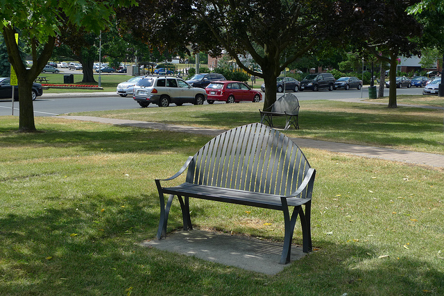

# 1. 기존에 정의된 모델 및 표준 데이터 세트를 이용하여 학습 및 추론


MMDetection은 [Model zoo](https://mmdetection.readthedocs.io/en/latest/model_zoo.html) 에서 수많은 객체 탐지 모델을 제공하고, Pascal VOC, COCO, CityScapes, LVIS 등을 포함한 여러가지 데이터 세트를 지원한다.

---

## 목차


1. [기존 모델을 사용하여 주어진 이미지 추론](##1.기존-모델을-사용하여-주어진-이미지-추론)

2. [표준 데이터 세트에서 기존 모델을 테스트](##2. 표준 데이터 세트에서 기존 모델을 테스트)

3. [표준 데이터 세트에서 사전 정의된 모델을 학습]()

---

## 1. 기존 모델을 사용하여 주어진 이미지 추론
추론이란 훈련된 모델을 사용해 이미지에서 객체를 탐색하는 것을 의미한다.
MMDetection에서 모델은 구성 파일에 의해 정의되고 기존 모델의 매개변수는 체크포인트파일에 저장된다.

우선 이 구성파일(configure file)과 체크포인트(ckp) 파일을 사용하여 Faster RCNN을 사용 해보는 것을 권장한다.
<br>  
<br>  

**<U>추론을 위한 고급 API 사용 예시</U>**

``` python
## git mmdetection 이 설치되어있어야 한다.

from mmdet.apis import init_detector, inference_detector
import mmcv

# Specify the path to model config and checkpoint file
config_file = 'configs/faster_rcnn/faster_rcnn_r50_fpn_1x_coco.py'

## 
checkpoint_file = 'checkpoints/faster_rcnn_r50_fpn_1x_coco_20200130-047c8118.pth'

# build the model from a config file and a checkpoint file
# os.environ['CUDA_LAUNCH_BLOCKING'] = "1" 쿠다 오류가 있는 경우 해당설정을 통해 에러가 발생하지 않음.
model = init_detector(config_file, checkpoint_file, device='cuda:0')

# test a single image and show the results
img = 'demo.jpg'  # or img = mmcv.imread(img), which will only load it once
result = inference_detector(model, img)
# visualize the results in a new window
model.show_result(img, result)
# or save the visualization results to image files
model.show_result(img, result, out_file='result.jpg')

# test a video and show the results
video = mmcv.VideoReader('demo.mp4')
for frame in video:
    result = inference_detector(model, frame)
    # show option을 추가해서 프레임단위로 결과를 볼 수 있지만 프레임 수가 많으므로 주의!
    model.show_result(frame, result, wait_time=1) 
```

***입력 이미지***


***출력 이미지***


## deomos
소스코드 동작 스크립트 제공 (mmdetction/demo)

이미지 객체 검출 데모
```shell
python demo/image_demo.py \
    ${IMAGE_FILE} \
    ${CONFIG_FILE} \
    ${CHECKPOINT_FILE} \
    [--device ${GPU_ID}] \
    [--score-thr ${SCORE_THR}]
```

 실제 사용 예시
```
python demo/image_demo.py demo/demo.jpg configs/faster_rcnn/faster_rcnn_r50_fpn_1x_coco.py checkpoints/faster_rcnn_r50_fpn_1x_coco_20200130-047c8118.pth --device cuda --score-thr 0.3 --out-file 'image_deomo_output.png'
```
---
비디오 데모
```shell
python demo/video_demo.py \
    ${VIDEO_FILE} \
    ${CONFIG_FILE} \
    ${CHECKPOINT_FILE} \
    [--device ${GPU_ID}] \
    [--score-thr ${SCORE_THR}] \
    [--out ${OUT_FILE}] \
    [--show] \
    [--wait-time ${WAIT_TIME}]
```

실제 사용 예시
```shell
python demo/video_demo.py demo/demo.mp4 \
    configs/faster_rcnn/faster_rcnn_r50_fpn_1x_coco.py \
    checkpoints/faster_rcnn_r50_fpn_1x_coco_20200130-047c8118.pth \
    --out result.mp4
```

GPU 사용 비디오 데모
```shell
python demo/video_gpuaccel_demo.py \
    ${VIDEO_FILE} \
    ${CONFIG_FILE} \
    ${CHECKPOINT_FILE} \
    [--device ${GPU_ID}] \
    [--score-thr ${SCORE_THR}] \
    [--nvdecode] \
    [--out ${OUT_FILE}] \
    [--show] \
    [--wait-time ${WAIT_TIME}]
```

실제 사용 예시
```shell
python demo/video_gpuaccel_demo.py demo/demo.mp4 \
    configs/faster_rcnn/faster_rcnn_r50_fpn_1x_coco.py \
    checkpoints/faster_rcnn_r50_fpn_1x_coco_20200130-047c8118.pth \
    --nvdecode --out result.mp4
```
---

## 2. 표준 데이터 세트에서 기존 모델을 테스트
일부 표준 데이터 세트를 사용하여 모델의 정확도를 평가합니다. MMdetection은 CoCo, Pascal VOC, CityScapes 등을 포함한 표준 데이터 세트를 지원한다.

## 데이터 세트 준비
[Pascal VOC](http://host.robots.ox.ac.uk/pascal/VOC/index.html) , [CoCo](#https://cocodataset.org/#download) 와 같은 공개 데이터 세트는 공식 웹 사이트 또는 링크를 참조 할 수 있다.<br>
(참고: 객체 탐지 작업에서 Pascal VOC 2012는 Pascal VOC 2007의 중복 없는 확장이며 일반적으로 함께 사용한다. ) <br>
$MMdetection/data 프로젝트 디렉토리 외부 어딘가에 데이터셋을 다운로드하여 추출하고 아래와 같이 데이터셋 루트를 심볼릭 링크하는 것이 좋다. 폴더 구조가 다른 경우 구성 파일에 해당 경로를 변경해야 할 수 있다.

COCO와 같은 데이터 세트를 다운로드하기 위한 스크립트를 제공합니다. 실행 하여 COCO 데이터 세트를 다운로드할 수 있다.
```shell
python tools/misc/download_dataset.py --dataset-name coco2017
```

자세한 사용법은 [dataset-download](https://github.com/open-mmlab/mmdetection/blob/master/docs/en/useful_tools.md#dataset-download) 를 참조하십시오.

```shell
mmdetection
├── mmdet
├── tools
├── configs
├── data
│   ├── coco
│   │   ├── annotations
│   │   ├── train2017
│   │   ├── val2017
│   │   ├── test2017
│   ├── cityscapes
│   │   ├── annotations
│   │   ├── leftImg8bit
│   │   │   ├── train
│   │   │   ├── val
│   │   ├── gtFine
│   │   │   ├── train
│   │   │   ├── val
│   ├── VOCdevkit
│   │   ├── VOC2007
│   │   ├── VOC2012
```
일부 모델에는 HTC, DetectoRS 및 SCNet과 같은 추가 COCO 데이터 세트가 필요하다. 다운로드 및 압축을 푼 다음 coco 폴더로 이동할 수 있습니다. 디렉토리는 다음과 같아야 한다.

```
mmdetection
├── data
│   ├── coco
│   │   ├── annotations
│   │   ├── train2017
│   │   ├── val2017
│   │   ├── test2017
│   │   ├── stuffthingmaps
```

PanopticFPN과 같은 Panoptic 분할 모델에는 추가 [COCO Panoptic](http://images.cocodataset.org/annotations/panoptic_annotations_trainval2017.zip) 데이터 세트가 필요합니다. 다운로드하고 압축을 푼 다음 coco 주석 폴더로 이동할 수 있습니다. 디렉토리는 다음과 같아야 합니다.
```
mmdetection
├── data
│   ├── coco
│   │   ├── annotations
│   │   │   ├── panoptic_train2017.json
│   │   │   ├── panoptic_train2017
│   │   │   ├── panoptic_val2017.json
│   │   │   ├── panoptic_val2017
│   │   ├── train2017
│   │   ├── val2017
│   │   ├── test2017
```

도시 경관 주석은 다음을 사용하여 coco 형식으로 변환해야 합니다
```
tools/dataset_converters/cityscapes.py.
```
```
pip install cityscapesscripts

python tools/dataset_converters/cityscapes.py \
    ./data/cityscapes \
    --nproc 8 \
    --out-dir ./data/cityscapes/annotations
```

---
## 기존 모델 테스트
COCO, PASCAL VOC, Cityscapes 등 데이터 세트에서 기존 모델을 평가히기 위한 트스트 스크립트를 제공한다.

- 단일 GPU
- CPU
- 단일 노드 다중 GPU
- 여러 노드

테스트 환경에 따라 수행할 적절한 스크립트를 선택하여 실행한다.
```
# single-gpu testing
python tools/test.py \
    ${CONFIG_FILE} \
    ${CHECKPOINT_FILE} \
    [--out ${RESULT_FILE}] \
    [--eval ${EVAL_METRICS}] \
    [--show]

# CPU: disable GPUs and run single-gpu testing script
export CUDA_VISIBLE_DEVICES=-1
python tools/test.py \
    ${CONFIG_FILE} \
    ${CHECKPOINT_FILE} \
    [--out ${RESULT_FILE}] \
    [--eval ${EVAL_METRICS}] \
    [--show]

# multi-gpu testing
bash tools/dist_test.sh \
    ${CONFIG_FILE} \
    ${CHECKPOINT_FILE} \
    ${GPU_NUM} \
    [--out ${RESULT_FILE}] \
    [--eval ${EVAL_METRICS}]
```
tools/dist_test.sh 다중 노드 테스트도 지원하지만 PyTorch의 실행 유틸리티에 의존한다.

옵션 인수:
- RESULT_FILE: 피클 형식의 출력 결과 파일 이름입니다. 지정하지 않으면 결과가 파일에 저장되지 않습니다.

- EVAL_METRICS: 결과에 대해 평가할 항목입니다. 허용 되는 값 은 데이터 세트 proposal_fast에 proposal따라 다릅니다 . 도시경관은 모든 COCO 메트릭으로 평가할 수 있습니다 .bboxsegmmAPrecallcityscapes

- --show: 지정하면 감지 결과가 이미지에 플롯되고 새 창에 표시됩니다. 단일 GPU 테스트에만 적용 가능하며 디버깅 및 시각화에 사용됩니다. 사용자 환경에서 GUI를 사용할 수 있는지 확인하십시오. 그렇지 않으면 와 같은 오류가 발생할 수 있습니다 .cannot connect to X server

- --show-dir: 지정하면 감지 결과가 이미지에 그려지고 지정된 디렉토리에 저장됩니다. 단일 GPU 테스트에만 적용 가능하며 디버깅 및 시각화에 사용됩니다. 이 옵션을 사용하기 위해 사용자 환경에서 사용 가능한 GUI가 필요하지 않습니다.

- --show-score-thr: 지정된 경우 이 임계값 미만의 점수를 가진 탐지는 제거됩니다.

- --cfg-options: 지정된 경우 키-값 쌍 선택적 cfg가 구성 파일에 병합됩니다.

- --eval-options: 지정된 경우 키-값 쌍 선택적 eval cfg는 dataset.evaluate() 함수에 대해 kwargs가 되며 평가 전용입니다.

### 사용 예시
체크포인트를 이미 다운로드 했다고 가정한다. (checkpoints/)
1. Faster R-CNN을 테스트하고 결과를 시각화합니다. 구성 및 체크 포인트 파일 -> [여기에서](https://github.com/open-mmlab/mmdetection/tree/master/configs/faster_rcnn)

```
python tools/test.py \
    configs/faster_rcnn/faster_rcnn_r50_fpn_1x_coco.py \
    checkpoints/faster_rcnn_r50_fpn_1x_coco_20200130-047c8118.pth \
    --show
```

2. Faster R-CNN을 테스트하고 향후 시각화를 위해 칠해진 이미지를 저장한다. 구성 및 체크포인트 파일 -> [여기에서](https://github.com/open-mmlab/mmdetection/tree/master/configs/faster_rcnn)
```
python tools/test.py \
    configs/faster_rcnn/faster_rcnn_r50_fpn_1x_coco.py \
    checkpoints/faster_rcnn_r50_fpn_1x_coco_20200130-047c8118.pth \
    --show-dir faster_rcnn_r50_fpn_1x_results
```

3. PASCAL VOC에서 Faster R-CNN을 테스트하고(테스트 결과를 저장하지 않고) mAP를 평가합니다. 구성 및 체크포인트 파일 -> [여기에서](https://github.com/open-mmlab/mmdetection/tree/master/configs/pascal_voc)
```
python tools/test.py \
    configs/pascal_voc/faster_rcnn_r50_fpn_1x_voc.py \
    checkpoints/faster_rcnn_r50_fpn_1x_voc0712_20200624-c9895d40.pth \
    --eval mAP
```

4. 8개의 GPU로 마스크 R-CNN을 테스트하고 bbox 및 마스크 AP를 평가합니다. 구성 및 체크포인트 파일은 -> [여기에서](https://github.com/open-mmlab/mmdetection/tree/master/configs/mask_rcnn)
```
./tools/dist_test.sh \
    configs/mask_rcnn_r50_fpn_1x_coco.py \
    checkpoints/mask_rcnn_r50_fpn_1x_coco_20200205-d4b0c5d6.pth \
    8 \
    --out results.pkl \
    --eval bbox segm
```

5. 8개의 GPU로 마스크 R-CNN을 테스트하고 클래스별 bbox 및 마스크 AP를 평가 합니다 . 구성 및 체크포인트 파일 -> [여기에서](https://github.com/open-mmlab/mmdetection/tree/master/configs/mask_rcnn)
```
./tools/dist_test.sh \
    configs/mask_rcnn/mask_rcnn_r50_fpn_1x_coco.py \
    checkpoints/mask_rcnn_r50_fpn_1x_coco_20200205-d4b0c5d6.pth \
    8 \
    --out results.pkl \
    --eval bbox segm \
    --options "classwise=True"
```

6. 8개의 GPU가 있는 COCO test-dev에서 R-CNN을 테스트하고 공식 평가 서버에 제출할 JSON 파일을 생성합니다. 구성 및 체크포인트 파일 -> [여기에서](https://github.com/open-mmlab/mmdetection/tree/master/configs/mask_rcnn)
```
./tools/dist_test.sh \
    configs/mask_rcnn/mask_rcnn_r50_fpn_1x_coco.py \
    checkpoints/mask_rcnn_r50_fpn_1x_coco_20200205-d4b0c5d6.pth \
    8 \
    --format-only \
    --options "jsonfile_prefix=./mask_rcnn_test-dev_results"
```
이 명령어를 실행 했을 때 두 개의 JSON 파일 ```mask_rcnn_test-dev_results.bbox.json```과 ```mask_rcnn_test-dev_results.segm.json.``` 이 생성된다.

7. 8개의 GPU로 Cityscapes 테스트에서 마스크 R-CNN을 테스트하고 공식 평가 서버에 제출할 txt 및 png 파일을 생성합니다. 구성 및 체크포인트 파일 -> [여기에서](https://github.com/open-mmlab/mmdetection/tree/master/configs/cityscapes)
```
./tools/dist_test.sh \
    configs/cityscapes/mask_rcnn_r50_fpn_1x_cityscapes.py \
    checkpoints/mask_rcnn_r50_fpn_1x_cityscapes_20200227-afe51d5a.pth \
    8 \
    --format-only \
    --options "txtfile_prefix=./mask_rcnn_cityscapes_test_results"
```
생성된 이미지 및 txt는  ./mask_rcnn_cityscapes_test_result 디렉토리 경로에 있습니다.

---

## Ground Truth 주석 없이 테스트


